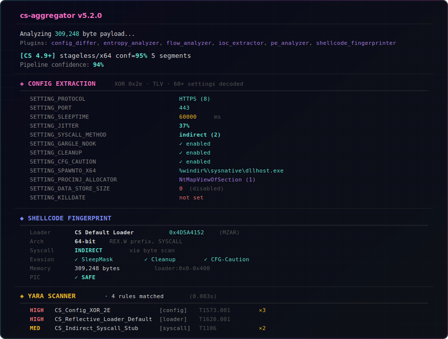
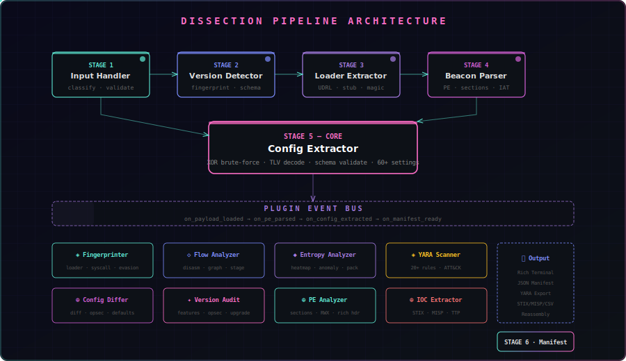
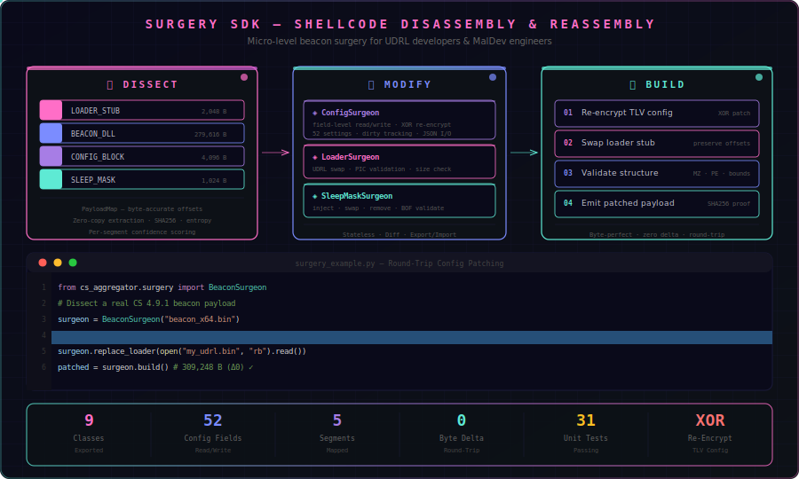
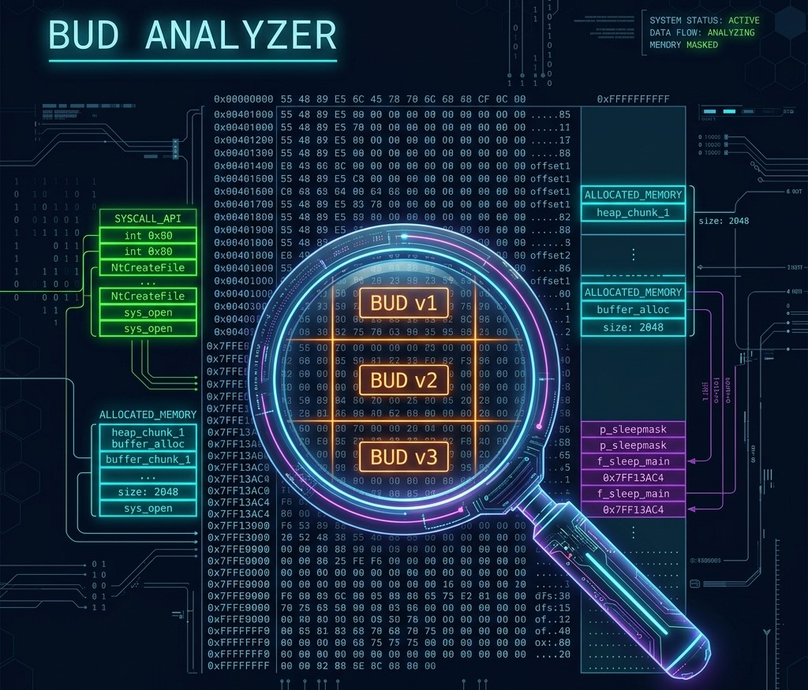
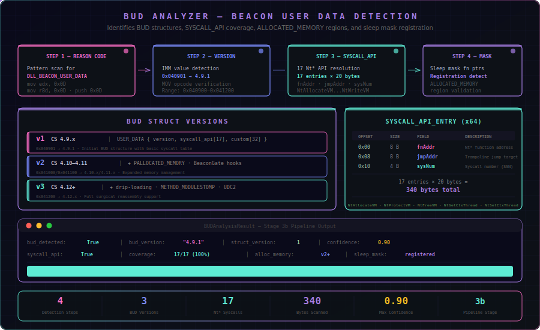
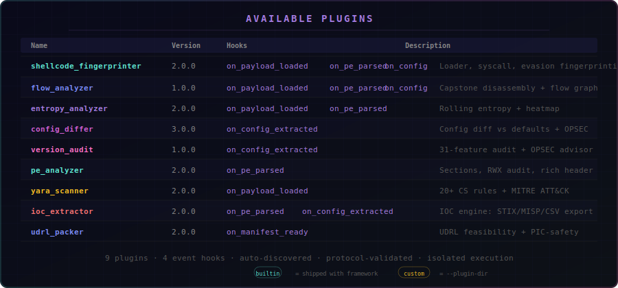
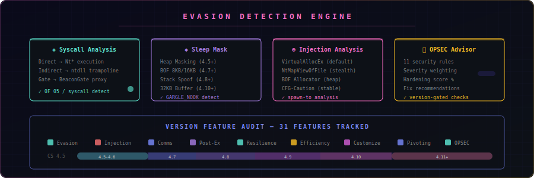
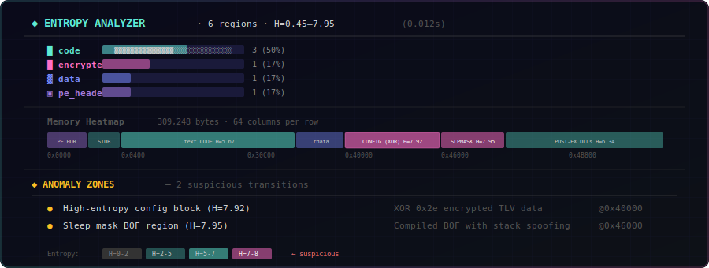
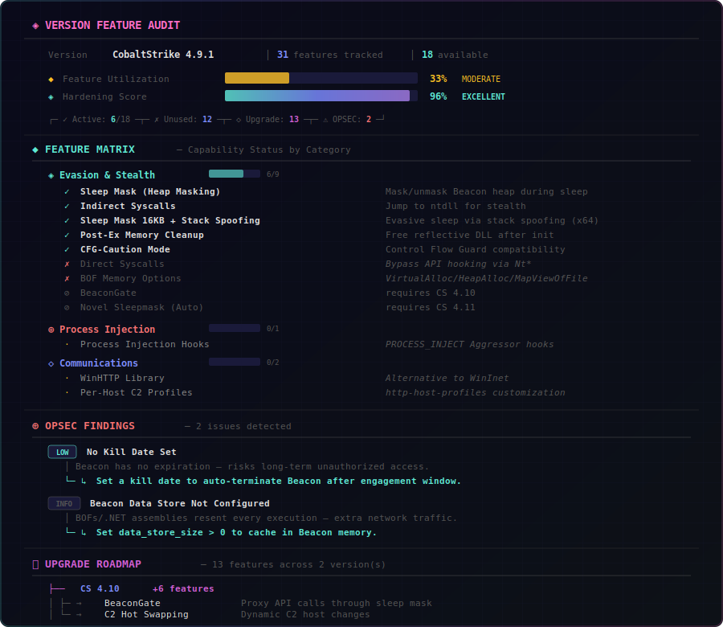

<p align="center">
  
</p>

<p align="center">
  <a href="#-quick-start"></a>
  <a href="#-pipeline-modules"></a>
  <a href="#-plugin-system"></a>
  <a href="#-version-support"></a>
  <a href="LICENSE"></a>
</p>

<p align="center">
  <b>CobaltStrike Beacon Shellcode Aggregation & Dissection Engine</b><br/>
  <sub>Version-adaptive analysis framework with Surgery SDK, BUD Analyzer, 9 plugins, IOC Central Engine, OPSEC Advisor, and high-fidelity Rich terminal output</sub>
</p>

---

## 🎯 Overview

**KimiK0** is a from-scratch Python framework for deep forensic dissection and **surgical modification** of CobaltStrike beacon shellcode payloads. It decomposes raw shellcode into its constituent components — loader stub, beacon DLL, config block, sleep mask — feeds them through a 7-stage pipeline, and enables **round-trip disassembly → modification → reassembly** via the Surgery SDK.

### Why KimiK0?

| Feature | KimiK0 | Generic Parsers |
|---------|--------|-----------------|
| **Version-Adaptive** | JSON schema per CS version (4.5 → 4.12+) | Hard-coded offsets |
| **Surgery SDK** | Dissect → modify config/loader/mask → rebuild | Extract only |
| **BUD Analysis** | Beacon User Data v1/v2/v3 + SYSCALL_API | Not supported |
| **Batch Processing** | Glob-based multi-file + multi-beacon extraction | Single file |
| **Fragment Reassembly** | Drip-loading fragment stitching (CS 4.12+) | Not supported |
| **YARA-X Powered** | Modern Rust-based YARA-X engine (20+ rules) | Legacy yara-python |
| **Cross-Validation** | pefile/dissect diff reports | Manual comparison |
| **Zero Core Dependencies** | Custom PE parser, XOR/TLV decoder | Requires pefile, dissect |
| **Plugin Architecture** | 9 builtin + user extensible via event bus | Monolithic |
| **OPSEC Advisor** | 13 security rules with hardening score | None |
| **IOC Export** | STIX 2.1, MISP, CSV, YARA generation | Manual extraction |
| **Rich Terminal** | Gradient gauges, heatmaps, flow graphs | Plain text |

---

## ⚡ Quick Start

```bash
# Install with uv (recommended)
uv pip install -e .

# Or with pip
pip install -e .

# Basic analysis — full Rich output
cs-aggregator beacon.bin

# Minimal summary
cs-aggregator beacon.bin --minimal

# With C2 profile for deep validation
cs-aggregator beacon.bin --profile malleable.profile

# JSON manifest to file
cs-aggregator beacon.bin -o manifest.json -v

# Extract all components
cs-aggregator beacon.bin --output-dir ./extracted/

# Batch process multiple payloads
cs-aggregator --batch "samples/*.bin" -o batch_results.json

# Cross-validate with pefile + dissect
cs-aggregator beacon.bin --validate-with both

# Fragment reassembly (drip-loading)
cs-aggregator --fragment-mode frag1.bin frag2.bin frag3.bin

# Pipe from stdin
cat beacon.bin | cs-aggregator -
```

<p align="center">
  
  <br/>
  <sub>Full Rich terminal output with config table, version detection, and plugin results</sub>
</p>

---

## 🏗️ Architecture

<p align="center">
  
</p>

KimiK0 uses a **7-stage event-driven pipeline** where each module processes independently and emits events that plugins subscribe to.

### Pipeline Modules

| Stage | Module | Hook | Description |
|:-----:|--------|------|-------------|
| **1** | `MOD_INPUT` | `on_payload_loaded` | Payload classification — staged vs stageless, x86 vs x64 |
| **2** | `MOD_VERSION_DETECTOR` | — | Two-stage CS version fingerprinting via loader + TLV signatures |
| **3** | `MOD_LOADER_EXTRACTOR` | — | Reflective loader stub extraction, UDRL classification |
| **3b** | `MOD_BUD_ANALYZER` | — | Beacon User Data v1/v2/v3 detection + SYSCALL_API coverage |
| **4** | `MOD_BEACON_PARSER` | `on_pe_parsed` | Custom PE parser — sections, imports, exports, rich header |
| **5** | `MOD_CONFIG_EXTRACTOR` | `on_config_extracted` | XOR brute-force → TLV decode → schema validation → 60+ settings |
| **6** | `MOD_SLEEPMASK_EXTRACTOR` | — | Sleep mask BOF extraction with BeaconGate detection |
| **7** | `MOD_MANIFEST_GENERATOR` | `on_manifest_ready` | JSON manifest with per-segment confidence scores |

Additional specialized modules:
- **`MOD_POSTEX_EXTRACTOR`** — Post-exploitation DLL reference extraction
- **`MOD_REASSEMBLER`** — Payload reassembly with component replacement

---

## ⚕️ Surgery SDK

<p align="center">
  
</p>

The Surgery SDK provides micro-level access to beacon shellcode for **UDRL developers**, **MalDev engineers**, and **red team operators**. Dissect real payloads, modify individual components, and rebuild byte-perfect shellcode with re-encrypted configs.

<p align="center">
  
</p>

### Core Classes

| Class | Purpose |
|-------|----------|
| `BeaconSurgeon` | High-level orchestrator — load, modify, build |
| `ConfigSurgeon` | Field-level config read/write with XOR re-encryption |
| `LoaderSurgeon` | UDRL replacement with PIC validation |
| `SleepMaskSurgeon` | Sleep mask inject/swap/remove |
| `PayloadMap` | Byte-accurate segment boundary mapping |
| `SurgeryValidator` | Pre/post surgery structural integrity checks |
| `ComponentExtractor` | PRD-compliant multi-file extraction |

```python
from cs_aggregator.surgery import BeaconSurgeon

surgeon = BeaconSurgeon("beacon_x64.bin")

# Read any config field
print(surgeon.config.get_int("SETTING_SLEEPTIME"))  # 120000
print(surgeon.config.get_str("SETTING_DOMAINS"))    # "evil.com,/api/v1"

# Surgical modification
surgeon.config["SETTING_SLEEPTIME"] = 15000
surgeon.config["SETTING_JITTER"] = 65

# Swap UDRL loader
surgeon.replace_loader(open("my_udrl.bin", "rb").read())

# Build → byte-perfect with re-encrypted config
patched = surgeon.build()  # 309,248 bytes (zero delta)
```

---

## 🔬 BUD Analyzer

<p align="center">
  
</p>

The BUD (Beacon User Data) Analyzer detects and parses the `USER_DATA` structures that custom UDRLs construct for beacon initialization. It identifies BUD version, SYSCALL_API coverage, ALLOCATED_MEMORY regions, and sleep mask registration.

<p align="center">
  
</p>

### Detection Capabilities

| Capability | Method |
|-----------|--------|
| BUD Reason Code | Pattern scan for `DLL_BEACON_USER_DATA` (0x0D) |
| BUD Version | Immediate value match (0x040901 = 4.9.1) |
| SYSCALL_API | 17 Nt* API resolution detection |
| ALLOCATED_MEMORY | v2+ struct initialization heuristics |
| Sleep Mask | Function pointer registration detection |
| Schema Cross-Ref | Validate against version-specific expectations |

---

## 🔌 Plugin System

Plugins subscribe to pipeline events via the **Plugin Event Bus**. Each plugin is auto-discovered, validated against the Protocol contract, and executed in isolation.

<p align="center">
  
  <br/>
  <sub>9 built-in plugins with event-driven hooks and isolated execution</sub>
</p>

### Built-in Plugins

| Plugin | Version | Hooks | Description |
|--------|---------|-------|-------------|
| **`shellcode_fingerprinter`** | 2.0.0 | `payload` `pe` `config` | Loader, architecture, syscall, evasion, memory layout fingerprinting |
| **`flow_analyzer`** | 1.0.0 | `payload` `pe` `config` | Execution flow tracing via Capstone disassembly, relational graph, stage analysis |
| **`entropy_analyzer`** | 2.0.0 | `payload` `pe` | Rolling entropy, anomaly zone detection, heatmap, packed section identification |
| **`config_differ`** | 3.0.0 | `config` | Auto-diff vs CS defaults, security-critical highlights, OPSEC scoring |
| **`version_audit`** | 1.0.0 | `config` | 41-feature CS version audit (4.5–4.12), 13 OPSEC rules, hardening advisor |
| **`pe_analyzer`** | 2.0.0 | `pe` | Deep PE: sections, RWX audit, data directories, rich header, security assessment |
| **`yara_scanner`** | 4.0.0 | `payload`, `pe` | 14 builtin + custom/community YARA-X rules, multi-target scanning, MITRE ATT&CK |
| **`ioc_extractor`** | 2.0.0 | `pe` `config` | Central IOC engine: network, behavioral, crypto, TTP mapping + STIX/MISP/CSV export |
| **`udrl_packer`** | 2.0.0 | `manifest` | UDRL packing feasibility analysis, PIC-safety checks, payload geometry |

### Custom Plugins

```python
# ~/.kimik0/plugins/my_plugin.py
class MyCustomPlugin:
    name = "my_plugin"
    version = "1.0.0"
    hooks = ["on_config_extracted"]

    def initialize(self, config):
        pass

    def on_config_extracted(self, config, ctx):
        # Your analysis logic
        return {"custom_data": "value"}

    def render_results(self):
        from rich.text import Text
        return Text("My Plugin Output", style="bold cyan")
```

```bash
# Load custom plugins
cs-aggregator beacon.bin --plugin-dir ~/.kimik0/plugins/

# Run specific plugins only
cs-aggregator beacon.bin --run-plugin version_audit,config_differ
```

---

## 🛡️ Evasion Detection

<p align="center">
  
</p>

KimiK0 detects and classifies **all major CS evasion techniques**:

<p align="center">
  
  <br/>
  <sub>Rolling entropy heatmap with anomaly zone detection across payload regions</sub>
</p>

| Technique | Detection Method | CS Version |
|-----------|-----------------|------------|
| **Direct Syscalls** | `0F 05` opcode scan, `SETTING_SYSCALL_METHOD=1` | 4.8+ |
| **Indirect Syscalls** | ntdll trampoline pattern, `SETTING_SYSCALL_METHOD=2` | 4.8+ |
| **BeaconGate** | `SETTING_BEACON_GATE` (ID 77) presence | 4.10+ |
| **Sleep Mask** | `SETTING_GARGLE_NOOK` + entropy analysis of mask region | 4.5+ |
| **Stack Spoofing** | Sleep mask BOF size analysis (16KB+ = stack spoof capable) | 4.8+ |
| **CFG-Caution** | `SETTING_CFG_CAUTION` flag | 4.9+ |
| **Post-Ex Cleanup** | `SETTING_CLEANUP` flag | 4.9+ |
| **RDLL Drip Loading** | `SETTING_RDLL_USE_DRIPLOADING` flag | 4.12+ |

---

## 📊 Version Feature Audit

The **Version Feature Audit** plugin maps 41 CobaltStrike features across versions 4.5–4.12, tracks active usage in the payload config, and provides automated OPSEC recommendations:

<p align="center">
  
  <br/>
  <sub>Feature utilization gauges, category matrix with status icons, and OPSEC findings</sub>
</p>

### OPSEC Rules

| ID | Severity | Check | Fix |
|----|----------|-------|-----|
| `OPSEC-001` | 🔴 Critical | No syscall evasion | Set `stage.syscall_method` to `indirect` |
| `OPSEC-002` | 🔴 Critical | Sleep mask disabled | Set `stage.sleep_mask = true` |
| `OPSEC-003` | 🟠 High | Default spawn-to (`rundll32.exe`) | Change to `dllhost.exe` or `gpupdate.exe` |
| `OPSEC-004` | 🟠 High | Low jitter value (<10%) | Set `host.jitter >= 30` |
| `OPSEC-005` | 🟡 Medium | No post-ex cleanup | Set `post-ex.cleanup = true` |
| `OPSEC-006` | 🟡 Medium | CFG-Caution disabled | Set `stage.cfg_caution = true` |
| `OPSEC-007` | 🟠 High | HTTP protocol (unencrypted) | Use HTTPS or DNS beacons |
| `OPSEC-008` | 🟢 Low | No kill date | Set engagement window expiration |
| `OPSEC-009` | ⚪ Info | Data store not configured | Set `data_store_size > 0` |
| `OPSEC-010` | 🟠 High | Default injection allocator | Use `NtMapViewOfSection` |
| `OPSEC-011` | ⚪ Info | No exit function | Set `stage.exit_func = ExitThread` |
| `OPSEC-012` | 🟡 Medium | Sleep mask without BeaconGate | Enable BeaconGate for call-stack spoofing |
| `OPSEC-013` | ⚪ Info | Drip loading without delay | Set `rdll_dripload_delay` to 50–200ms |

---

## 🌐 Version Support

| CS Version | Schema | BUD | Key Features |
|:----------:|--------|:---:|-------------|
| **4.5** | `4.9.0.json` | — | Sleep mask heap masking, process injection hooks, arsenal kit |
| **4.7** | `4.9.0.json` | — | Sleep mask BOF (8KB), SOCKS5, BOF memory options |
| **4.8** | `4.9.0.json` | — | Direct/indirect syscalls, payload guardrails, token store, stack spoofing |
| **4.9.x** | `4.9.1.json` | **v1** | Post-ex UDRLs, beacon data store, WinHTTP, CFG-caution, post-ex cleanup |
| **4.10.x** | `4.10.x.json` | **v2** | BeaconGate, sleep mask 32KB, PostEx kit overhaul, C2 hot swap, BOF gate APIs |
| **4.11.x** | `4.11.x.json` | **v2** | Novel sleepmask, ObfSetThreadContext, sRDI loader v2, async BOF, DoH |
| **4.12.x** | `4.12.x.json` | **v3** | Drip loading, UDC2, RtlCloneUserProcess, pivot beacon sleepmask, TP injection |

---

## 📤 Export Formats

### IOC Export

```bash
# STIX 2.1 bundle
cs-aggregator beacon.bin --export-ioc stix

# MISP event JSON
cs-aggregator beacon.bin --export-ioc misp

# CSV spreadsheet
cs-aggregator beacon.bin --export-ioc csv

# Multiple formats
cs-aggregator beacon.bin --export-ioc stix misp csv
```

### YARA Rule Generation

```bash
# Generate payload-specific YARA rules from dissection results
cs-aggregator beacon.bin --export-yara beacon_rules.yar
```

Generates 4 detection rules:
- **Config Block Signature** — XOR'd TLV header bytes
- **Loader Stub Signature** — Reflective loader opcode sequence
- **Network IOC Rule** — C2 URI, user-agent, named pipes, spawn-to
- **Composite Behavioral** — Combined PE magic + call pattern detection

### Custom & Community YARA Rules

The YARA scanner plugin supports extending the 14 builtin CS detection rules with custom or community-sourced rules. Rules are compiled into isolated namespaces to prevent name collisions.

```bash
# Load a single custom rules file (extends builtin rules)
cs-aggregator beacon.bin --yara-rules my_rules.yar

# Load all .yar/.yara files from a directory (recursive)
cs-aggregator beacon.bin --yara-dir ./community_rules/

# Custom-only mode — skip builtin rules entirely
cs-aggregator beacon.bin --yara-no-builtin --yara-dir ./my_rules/

# Combine: custom file + directory + builtins
cs-aggregator beacon.bin --yara-rules extra.yar --yara-dir ./community/
```

**Multi-target scanning:** The YARA engine automatically scans both the raw payload AND the extracted DLL, with deduplication. Results show which target(s) matched each rule, with hex previews at match offsets.

**Builtin rule categories:** config, loader, sleepmask, syscall, injection, comms, network, fingerprint, evasion, postex — all with MITRE ATT&CK tagging.

---

## 🔧 CLI Reference

### Analysis Modes

```bash
# Full Rich terminal output (default)
cs-aggregator beacon.bin

# Minimal one-line summary
cs-aggregator beacon.bin --minimal

# Config-only extraction
cs-aggregator beacon.bin --config-only

# Quiet mode (errors to stderr only)
cs-aggregator beacon.bin -q

# Verbose / Debug
cs-aggregator beacon.bin -v      # info level
cs-aggregator beacon.bin -vv     # debug level
```

### Profile-Guided Analysis

```bash
# Validate config against Malleable C2 profile
cs-aggregator beacon.bin --profile beacon.profile

# Profile adds:
#   • StompPE detection
#   • Sleep mask validation
#   • Custom magic byte awareness
#   • Config field cross-validation
```

### Payload Reassembly

```bash
# Reassemble with custom UDRL
cs-aggregator beacon.bin --reassemble beacon.bin \
    --with-loader custom_udrl.bin \
    --output-payload modified.bin

# Replace sleep mask
cs-aggregator beacon.bin --reassemble beacon.bin \
    --with-sleep-mask custom_mask.bin \
    --output-payload modified.bin

# Modify config
cs-aggregator beacon.bin --reassemble beacon.bin \
    --with-config new_config.json \
    --xor-key 2e2e2e2e \
    --output-payload modified.bin
```

### Plugin Control

```bash
# List all available plugins
cs-aggregator --list-plugins

# Enable specific plugins
cs-aggregator beacon.bin --plugins entropy_analyzer,version_audit

# Run standalone plugin with JSON output
cs-aggregator beacon.bin --run-plugin version_audit --plugin-output json

# Load custom plugin directory
cs-aggregator beacon.bin --plugin-dir ./my_plugins/
```

### Cross-Validation

```bash
# Validate with pefile
cs-aggregator beacon.bin --validate-with pefile

# Validate with dissect.cobaltstrike
cs-aggregator beacon.bin --validate-with dissect

# Both
cs-aggregator beacon.bin --validate-with both
```

### Output Options

```bash
# JSON manifest to file
cs-aggregator beacon.bin -o manifest.json

# Extract all components to directory (9 files)
cs-aggregator beacon.bin --output-dir ./extracted/
#   Creates: *_loader_stub.bin, *_config.json, *_config_encrypted.bin,
#            *_config_decrypted.bin, *_sleep_mask.bin, *_manifest.json,
#            *_summary.txt, + metadata JSONs for each component

# Disable colors (auto-detected when piped)
cs-aggregator beacon.bin --no-color
```

### Advanced Analysis Flags

```bash
# Memory dump extraction at specific offset
cs-aggregator beacon.bin --memory-dump 0x1000 4096

# Scan for ALL embedded beacons in a payload
cs-aggregator beacon.bin --extract-all

# Manual decryption key (bypasses brute-force)
cs-aggregator beacon.bin --decryption-key 2e2e2e2e

# Extended 2-byte XOR brute-force (0x0000–0xFFFF key space)
cs-aggregator beacon.bin --extended-bruteforce

# Batch processing (glob/directory)
cs-aggregator --batch "./samples/*.bin" -o results.json

# Multi-beacon extraction (scan for all embedded MZ/PE)
cs-aggregator beacon.bin --extract-all -o all_beacons.json

# Fragment reassembly (drip-loading support)
cs-aggregator --fragment-mode loader.bin dll.bin config.bin
cs-aggregator --fragment-dir ./fragments/ --fragment-timeout 60

# Cross-validation against third-party parsers
cs-aggregator beacon.bin --validate-with pefile
cs-aggregator beacon.bin --validate-with dissect
cs-aggregator beacon.bin --validate-with both

# Loader stub disassembly (Capstone x86_64)
cs-aggregator beacon.bin --disassemble
```

---

## 🔖 CS Version Compatibility

> **⚠️ Important:** This project has been **fully tested and validated against CobaltStrike 4.9.1** payloads. Other CS versions (4.5–4.8, 4.10.x, 4.11.x, 4.12.x) are **structurally supported** via version-adaptive JSON schemas, but have **not been tested with real payloads** due to the unavailability of licensed CS builds for those versions.

| CS Version | Schema | Status | BUD | Sleep Mask | Notes |
|:----------:|:------:|:------:|:---:|:----------:|:------|
| **4.9.1** | `4.9.1.json` | ✅ **Fully Tested** | v1 | Simple XOR | Primary development target. All 201 tests validated. |
| 4.9.0 | `4.9.0.json` | 🟡 Compatible | v1 | Simple XOR | Identical TLV structure to 4.9.1 |
| 4.10.x | `4.10.x.json` | 🟡 Compatible | v2 | 32KB buffer | BeaconGate-aware schema. Untested — lacks real payloads |
| 4.11.x | `4.11.x.json` | 🟡 Compatible | v2 | Novel auto-obf | Prepend loader default. Untested — lacks real payloads |
| 4.12.x | `4.12.x.json` | 🟡 Compatible | v3 | Pivot beacon | Drip-loading, UDC2, BUD v3. Untested — lacks real payloads |
| 4.5–4.8 | `4.9.0.json` | 🟡 Compatible | — | — | Falls back to 4.9.0 schema |

Schemas for untested versions are derived from official CS documentation, release notes, and community research (dissect.cobaltstrike, SentinelOne CobaltStrikeParser). They contain accurate TLV type mappings, BUD structure definitions, and loader signature patterns, but have not been validated against real beacon payloads.

**Contributing test data:** If you have access to CS versions other than 4.9.1 and can share anonymized test payloads (XOR-encrypted config blocks, loader stubs), please open an issue.

---

## 🆕 v5.2.0 Changelog

### Schema Enrichment
- Added authoritative `settingTypes` map (IDs 1–80) to all 5 version schemas
- Added `settingValidation` semantic rules (port range, jitter 0–99%, enum fields) to 4.9.1 schema
- Enriched BUD structure details across all schemas: `reasonCode`, `versionHex`, `breakingChanges`
- Added TLV metadata (`tlvHeaderSize`, `tlvByteOrder`, `dataTypes`) to 4.10/4.11/4.12 schemas
- Expanded loader signature patterns in 4.9.1 (`udrl_prepend_standard`, `peb_walk_inmemoryorder`)

### Config Extractor Hardening
- **Per-field type validation** — `SETTING_EXPECTED_TYPES` dict validates actual TLV data type against expected for all 80 setting IDs
- **Semantic validation** — `SETTING_VALIDATION` checks decoded values (port range 1–65535, jitter 0–99, BeaconType enum, ExitFunction enum)
- **Enhanced TLV coverage report** — Now includes `typeMismatches` and `semanticWarnings` in coverage output

### Output Directory Extraction
- Added `write_full_extraction()` to OutputWriter for PRD-compliant component output
- `--output-dir` now writes 9+ files: manifest.json, loader_stub.bin, beacon.dll, config.json, config_raw_encrypted.bin, config_raw_decrypted.bin, sleep_mask.bin, per-component metadata JSONs, summary.txt

### Test Suite
- **201 tests passing** across 12 test files (2.0s execution)
- Schema validation tests rewritten for hex + decimal TLV key compatibility
- Added BUD version progression test and settingTypes presence test
- Excluded `schema_template` from structural validation


<details>
<summary><b>v5.1.0 Changelog</b></summary>

### YARA-X Extensible Engine (v4.0.0)
- Complete from-scratch migration from `yara-python` to **YARA-X** (v1.0+, Rust-based)
- **Custom rules**: `--yara-rules FILE` and `--yara-dir DIR` for community/custom rules
- **Namespace isolation**: Builtin + custom rules compiled in separate namespaces — no name collisions
- **Multi-target scanning**: Scans both raw payload and extracted DLL with deduplication
- **`--yara-no-builtin`**: Custom-only mode to skip builtin rules
- Enhanced output: severity grouping, MITRE ATT&CK matrix, hex previews, compilation stats
- Per-file error reporting for custom rule directories

### Batch Processing & Multi-Beacon Extraction
- **`--batch GLOB`** — Process multiple payloads via glob pattern
- **`--extract-all`** — Scan for all embedded MZ/PE headers
- JSON batch summary report with success/fail/skip counts

### Drip-Loading Fragment Reassembly
- **`--fragment-mode FILE [FILE ...]`** — Reassemble payload from multiple fragments
- **`--fragment-dir DIR`** — Reassemble from directory of fragments
- 5-component architecture with confidence scoring

### Cross-Validation & Disassembly
- **`--validate-with {pefile,dissect,both}`** — Field-by-field diff report
- **`--disassemble`** — Capstone x86_64 disassembly of loader stub

### Extended Bruteforce
- **`--extended-bruteforce`** — Expands XOR key search to 2-byte space (0x0000–0xFFFF)

</details>

---

## 📁 Project Structure

```
cs_aggregator/
├── __init__.py              # Package metadata (v5.2.0)
├── __main__.py              # Entry point
├── cli.py                   # CLI argument parser + orchestration (65KB)
├── engine.py                # 7-stage dissection pipeline (29KB)
├── surgery/                 # Surgery SDK — disassemble/modify/reassemble
│   ├── __init__.py          # Public API (8 classes)
│   ├── builder.py           # BeaconSurgeon orchestrator
│   ├── payload_map.py       # Byte-accurate segment mapping
│   ├── config_surgeon.py    # Field-level config surgery
│   ├── loader_surgeon.py    # UDRL replacement + PIC validation
│   ├── sleepmask_surgeon.py # Sleep mask inject/swap/remove
│   ├── validator.py         # Structural integrity validation
│   └── component_ops.py     # Component extraction utilities
├── modules/
│   ├── input_handler.py     # Payload classification
│   ├── version_detector.py  # CS version fingerprinting
│   ├── loader_extractor.py  # Reflective loader extraction
│   ├── beacon_parser.py     # Custom PE parser
│   ├── config_extractor.py  # XOR + TLV config decryption (36KB)
│   ├── sleepmask_extractor.py  # Sleep mask BOF extraction
│   ├── postex_extractor.py  # Post-exploitation DLL refs
│   ├── bud_analyzer.py      # BUD v1/v2/v3 structure analyzer
│   ├── fragment_reassembler.py  # [NEW] Drip-loading fragment reassembly
│   ├── manifest_generator.py   # JSON manifest builder
│   └── reassembler.py      # Payload reassembly engine
├── plugins/
│   ├── base.py              # Plugin protocol contracts
│   ├── hooks.py             # Hook point definitions
│   ├── manager.py           # Discovery + lifecycle + execution
│   └── builtin/
│       ├── shellcode_fingerprinter.py  # Multi-stage fingerprinting
│       ├── flow_analyzer.py    # Capstone disassembly + graph (65KB)
│       ├── entropy_analyzer.py # Rolling entropy + heatmap
│       ├── config_differ.py    # Config diff vs defaults
│       ├── version_audit.py    # Feature audit + OPSEC advisor (36KB)
│       ├── pe_analyzer.py      # Deep PE analysis
│       ├── yara_scanner.py     # Extensible YARA-X engine (v4.0.0)
│       ├── ioc_extractor.py    # IOC Central Engine
│       └── udrl_packer.py      # UDRL feasibility analysis
├── ioc_engine/
│   ├── __init__.py          # IOC Central orchestrator
│   ├── network_engine.py    # C2, DNS, HTTP IOC extraction
│   ├── behavioral_engine.py # Process, injection, persistence IOCs
│   ├── crypto_engine.py     # XOR keys, certificates, hashes
│   ├── ttp_mapper.py        # MITRE ATT&CK mapping
│   ├── yara_engine.py       # YARA-X powered dynamic generation
│   └── exporters.py         # STIX 2.1, MISP, CSV exporters
├── data/
│   └── schemas/
│       ├── 4.9.0.json       # CS 4.5–4.8 schema
│       ├── 4.9.1.json       # CS 4.9.x schema
│       ├── 4.10.x.json      # CS 4.10.x schema
│       ├── 4.11.x.json      # CS 4.11.x schema
│       └── 4.12.x.json      # CS 4.12+ schema
└── utils/
    ├── rich_output.py       # Rich terminal renderer
    ├── types.py             # Result dataclasses
    ├── pe_utils.py          # PE parsing utilities
    ├── cross_validator.py   # [NEW] Cross-validation reporter
    └── output_writer.py     # File output writer
```

---

## 🧪 Testing

```bash
# Run full test suite
python -m pytest tests/ -v

# Quick run
python -m pytest tests/ -x -q

# With coverage
python -m pytest tests/ --cov=cs_aggregator --cov-report=html

# Current: 201 tests passing across 12 test files (~2.0s)
```

| Test File | Tests | Coverage |
|-----------|:-----:|:--------:|
| `test_modules.py` | 14 | Input, Version, Loader, Beacon, Config, Manifest |
| `test_phase2.py` | 17 | SleepMask, PostEx extraction |
| `test_phase3.py` | 19 | Config serialization, Reassembly |
| `test_ioc_engine.py` | 20 | Network, Behavioral, Crypto, TTP, YARA, Exporters |
| `test_surgery.py` | 24 | ConfigSurgeon, LoaderSurgeon, BUD, BeaconSurgeon |
| `test_profile.py` | 11 | Malleable C2 profile parser |
| `test_schema_validation.py` | 56 | Schema structure, consistency, BUD progression |
| `test_engine_plugin_integration.py` | 7 | Pipeline + plugin lifecycle |
| `test_integration.py` | 15 | End-to-end pipeline |
| `test_utils.py` | 13 | Entropy, hashing, XOR |
| **Total** | **201** | **All passing ✅** |

---

## 📦 Installation

### Requirements

- **Python ≥ 3.11**
- **Core**: `rich >= 13.0`
- **Analysis**: `yara-x >= 1.0` (YARA-X, Rust-based), `capstone >= 5.0`
- **Cross-validation** (optional): `pefile`, `dissect.cobaltstrike`

### Install

```bash
# With uv (recommended)
uv pip install -e .

# With all optional dependencies
uv pip install -e ".[all]"

# Development
uv pip install -e ".[dev]"
```

---

## 🔒 Philosophy

1. **Zero required third-party dependencies** for core parsing — custom PE parser, custom XOR/TLV decoder
2. **Version-adaptive** — JSON schema plugin system enables supporting new CS versions by adding a schema file
3. **Graceful degradation** — each pipeline stage can fail independently without blocking the rest
4. **Event-driven** — plugins subscribe to hooks, enabling clean separation of concerns
5. **Operator-ready** — high-fidelity terminal output with gradient gauges, heatmaps, and actionable intelligence

---

## ⚠️ Disclaimer

This tool is designed for **authorized security research, red team operations, and incident response** only. It is intended to be used by security professionals to analyze CobaltStrike beacon payloads encountered during legitimate security assessments or forensic investigations.

- **No real payloads are included** in this repository
- **No C2 infrastructure details** are exposed
- **No license keys or proprietary CS data** are bundled
- All test data uses **synthetic payloads** generated for unit testing

Use responsibly and in accordance with applicable laws and regulations.

---

## 🤝 Contributing

1. Fork the repository
2. Create a feature branch (`git checkout -b feature/amazing-feature`)
3. Run the test suite (`python -m pytest tests/ -v`)
4. Commit your changes (`git commit -m 'feat: add amazing feature'`)
5. Push to the branch (`git push origin feature/amazing-feature`)
6. Open a Pull Request

**Note:** Do not commit real CS payloads, shellcode samples, or any sensitive operational data. All test data must be synthetic.

---

## 📄 License

MIT — see [LICENSE](LICENSE) for details.

<p align="center">
  <sub>Built by <b>y4kuz4</b> · KimiK0 CS Dissection Engine v5.2.0</sub>
</p>
